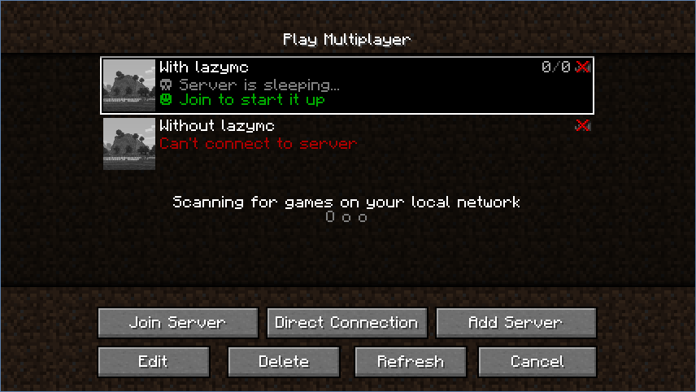
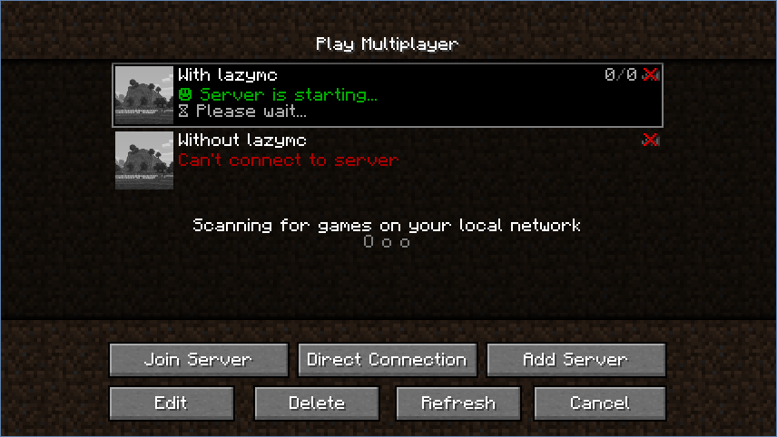
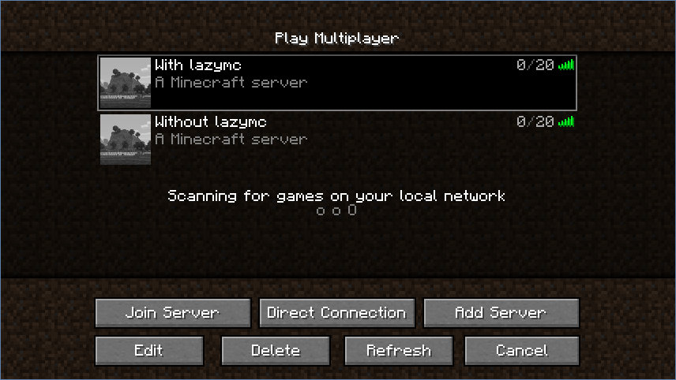

# lazymc

`lazymc` puts your Minecraft server to rest when idle, and wakes it up when
players connect.

Some Minecraft servers (especially modded) use an insane amount of
resources when nobody is playing. `lazymc` helps with this by stopping your
server when idle, until a player connects again.

`lazymc` functions as proxy between clients and the server. It handles all
incoming status connections until the server is started and then transparently
proxies the rest.

## Screenshots

## License
This project is released under the GNU GPL-3.0 license.
Check out the [LICENSE](LICENSE) file for more information.
