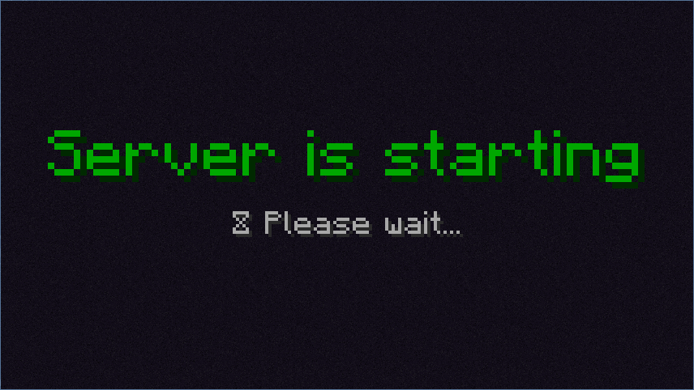

# Join method: lobby

**Note: this is highly experimental, incomplete, and may break your game. See
[warning](#warning).**

The lobby join method allows you to keep clients in a lobby world while the
server is starting. When the server is ready, the player is _teleported_ to the
real server.

`lazymc` emulates a fake server with an empty lobby world. The player is put in
this world, floating in space. A custom message is shown on the client to notify
we're waiting on the server to start.



## Warning

This feature is highly experimental, incomplete and unstable. This may break the
game and crash clients. Don't use this unless you know what you're doing. Never
enable this in a production environment.

Current limitations:

- Only works with offline mode
- Only works with vanilla Minecraft clients, does not work with modded (e.g. Forge, FTB)
- Probably only works with Minecraft 1.16.3-1.17.1 (tested with 1.17.1)
- This method will consume the client, following configured join methods won't be used.

At this time it is unknown if some of the above limitations will ever be lifted,
or if this will ever be implemented in a robust manner.

## Usage

_Note: you must use `lazymc v0.2.0` or above with the `lobby` feature enabled._

To try this out, simply add the `"lobby"` method to the `join.methods` list in
your `lazymc.toml` configuration file:

```toml
# -- snip --

[join]
methods = [
    "lobby",
    "kick",
]

# -- snip --
```

Then configure the lobby to your likings:

```toml
# -- snip --

[join.lobby]
# Lobby occupation method.
# The client joins a fake lobby server with an empty world, floating in space.
# A message is overlayed on screen to notify the server is starting.
# The client will be teleported to the real server once it is ready.
# This may keep the client occupied forever if no timeout is set.
# Consumes client, not allowing other join methods afterwards.

# !!! WARNING !!!
# This is highly experimental and unstable.
# This may break the game and crash clients.
# Don't enable this unless you know what you're doing.
#
# - Only works with offline mode
# - Only works with vanilla Minecraft clients, does not work with modded
# - Only tested with Minecraft 1.17.1

# Maximum time in seconds in the lobby while the server starts.
timeout = 600

# Message banner in lobby shown to client.
message = "§2Server is starting\n§7⌛ Please wait..."

# Sound effect to play when server is ready.
ready_sound = "block.note_block.chime"

# -- snip --

```

_Note: this might have changed, see the latest configuration
[here](../res/lazymc.toml)._
